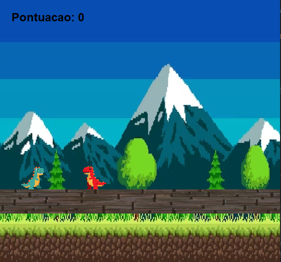
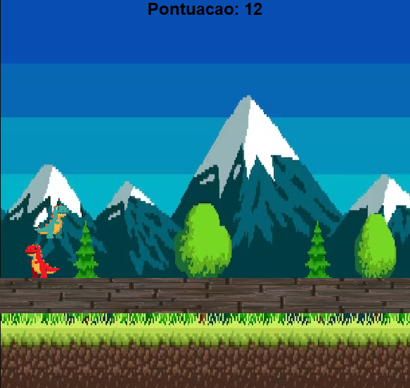
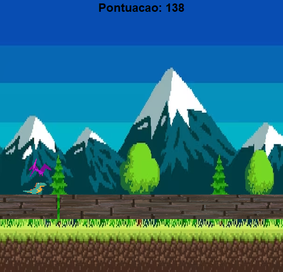

# 🌟 Dino Runner - Desafio de Sobrevivência no Deserto

**Dino Runner** é um emocionante jogo de sobrevivência inspirado no famoso jogo do dinossauro do Google, desenvolvido em Java. O objetivo do jogo é simples: ajude o dinossauro a sobreviver o máximo possível enfrentando uma série de obstáculos. O jogo desafia a habilidade do jogador em desviar de obstáculos aéreos e terrestres, testando seus reflexos e velocidade de reação.

## 🚀 Como Jogar:

- **Pule os obstáculos terrestres:** Pressione a tecla **Espaço** para fazer o dinossauro saltar sobre os obstáculos que aparecem no chão.
- **Abaixar-se para desviar dos obstáculos aéreos:** Pressione a tecla **Seta para baixo** para fazer o dinossauro abaixar e desviar dos obstáculos que voam.

À medida que o jogo avança, a velocidade e a frequência dos obstáculos aumentam, tornando o desafio cada vez mais emocionante. O objetivo é sobreviver o máximo possível e alcançar a maior pontuação!

## 🛠️ Funcionalidades:

- **Movimentação fluida:** O dinossauro pode pular e abaixar-se de forma ágil, criando uma experiência dinâmica de jogo.
- **Obstáculos desafiadores:** Enfrente obstáculos aéreos e terrestres que exigem rapidez e estratégia.
- **Aumento progressivo de dificuldade:** A cada rodada, os obstáculos se tornam mais rápidos e a sobrevivência mais difícil.

## 📚 Tecnologias Utilizadas:

- **Java:** O jogo foi desenvolvido inteiramente em Java, utilizando programação orientada a objetos.
- **Java Swing:** A interface gráfica foi construída com Java Swing, garantindo uma jogabilidade suave e responsiva.
- **Controle de Eventos:** As teclas de ação são capturadas de forma eficiente para permitir o controle preciso da movimentação do dinossauro.

Pronto, é só jogar e desafiar seus limites no mundo do Dino Runner! Boa sorte na jornada de sobrevivência! 🦖🌵
